# System Architecture - Event Planning Web Application

## 📐 Architecture Overview

The Event Planning Web Application follows a **three-tier architecture** pattern with clear separation of concerns:

```
┌─────────────────────────────────────────────────────────────┐
│                     PRESENTATION LAYER                       │
│              (React Frontend - Port 5173)                    │
└─────────────────────────────────────────────────────────────┘
                              ↕ 
                         HTTP/REST API
                              ↕
┌─────────────────────────────────────────────────────────────┐
│                    APPLICATION LAYER                         │
│         (Node.js/Express Backend - Port 5000)                │
└─────────────────────────────────────────────────────────────┘
                              ↕
                        Mongoose ODM
                              ↕
┌─────────────────────────────────────────────────────────────┐
│                       DATA LAYER                             │
│              (MongoDB Database - Port 27017)                 │
└─────────────────────────────────────────────────────────────┘
```

---

## 🏗️ High-Level Architecture Diagram

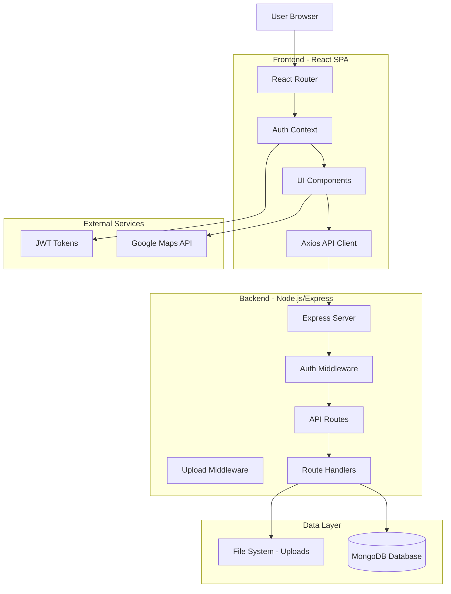

---

## 🎯 Technology Stack

### Frontend Technologies
| Component | Technology | Version | Purpose |
|-----------|-----------|---------|---------|
| **Framework** | React | 18.x | UI library for component-based architecture |
| **Build Tool** | Vite | 5.x | Fast development server and bundler |
| **Routing** | React Router | 6.x | Client-side navigation and routing |
| **Styling** | Tailwind CSS | 3.4.1 | Utility-first CSS framework |
| **HTTP Client** | Axios | 1.x | Promise-based HTTP requests |
| **Maps** | @react-google-maps/api | 2.x | Google Maps integration |
| **Icons** | React Icons | 5.x | Icon library |
| **State Management** | Context API | Built-in | Global authentication state |

### Backend Technologies
| Component | Technology | Version | Purpose |
|-----------|-----------|---------|---------|
| **Runtime** | Node.js | 14+ | JavaScript runtime environment |
| **Framework** | Express.js | 4.x | Web application framework |
| **Database** | MongoDB | 5.x+ | NoSQL document database |
| **ODM** | Mongoose | 8.x | MongoDB object modeling |
| **Authentication** | JWT | 9.x | Token-based authentication |
| **Password Hashing** | bcrypt.js | 2.x | Secure password encryption |
| **File Upload** | Multer | 1.4.x | Multipart form data handling |
| **Validation** | express-validator | 7.x | Input validation middleware |
| **CORS** | cors | 2.x | Cross-origin resource sharing |

---

## 🔄 System Components Architecture

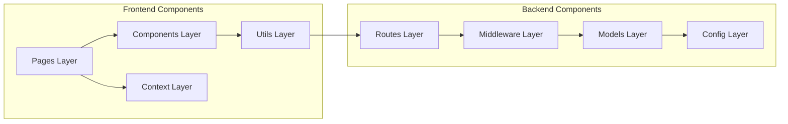

### Frontend Component Hierarchy

```
App.jsx (Root)
├── AuthProvider (Context)
│   ├── Navbar (Layout)
│   ├── Routes
│   │   ├── Public Routes
│   │   │   ├── Home
│   │   │   ├── Events
│   │   │   ├── EventDetail
│   │   │   ├── Login
│   │   │   └── Signup
│   │   └── Protected Routes
│   │       ├── UserDashboard
│   │       ├── AdminDashboard (Admin Only)
│   │       └── AdminEvents (Admin Only)
│   └── Footer (Layout)
└── Shared Components
    ├── EventCard
    ├── ProtectedRoute
    └── Loader
```

---

## 🗄️ Database Schema & Relationships

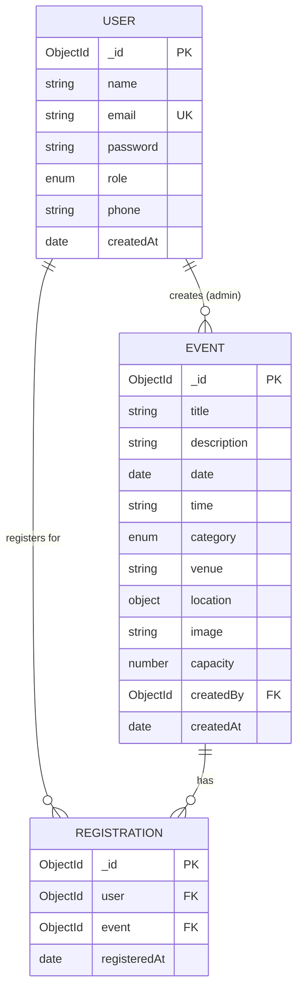

### Database Collections

**Users Collection**
```javascript
{
  _id: ObjectId,
  name: String (required),
  email: String (required, unique),
  password: String (hashed, required),
  role: String (enum: ['user', 'admin']),
  phone: String (optional),
  createdAt: Date
}
```

**Events Collection**
```javascript
{
  _id: ObjectId,
  title: String (required),
  description: String (required),
  date: Date (required),
  time: String (required),
  category: String (enum),
  venue: String (required),
  location: {
    lat: Number (required),
    lng: Number (required),
    address: String (optional)
  },
  image: String (filename),
  capacity: Number,
  createdBy: ObjectId (ref: User),
  createdAt: Date
}
```

**Registrations Collection**
```javascript
{
  _id: ObjectId,
  user: ObjectId (ref: User, required),
  event: ObjectId (ref: Event, required),
  registeredAt: Date
}
// Compound index: {user: 1, event: 1} - unique
```

---

## 🔐 Authentication & Authorization Flow

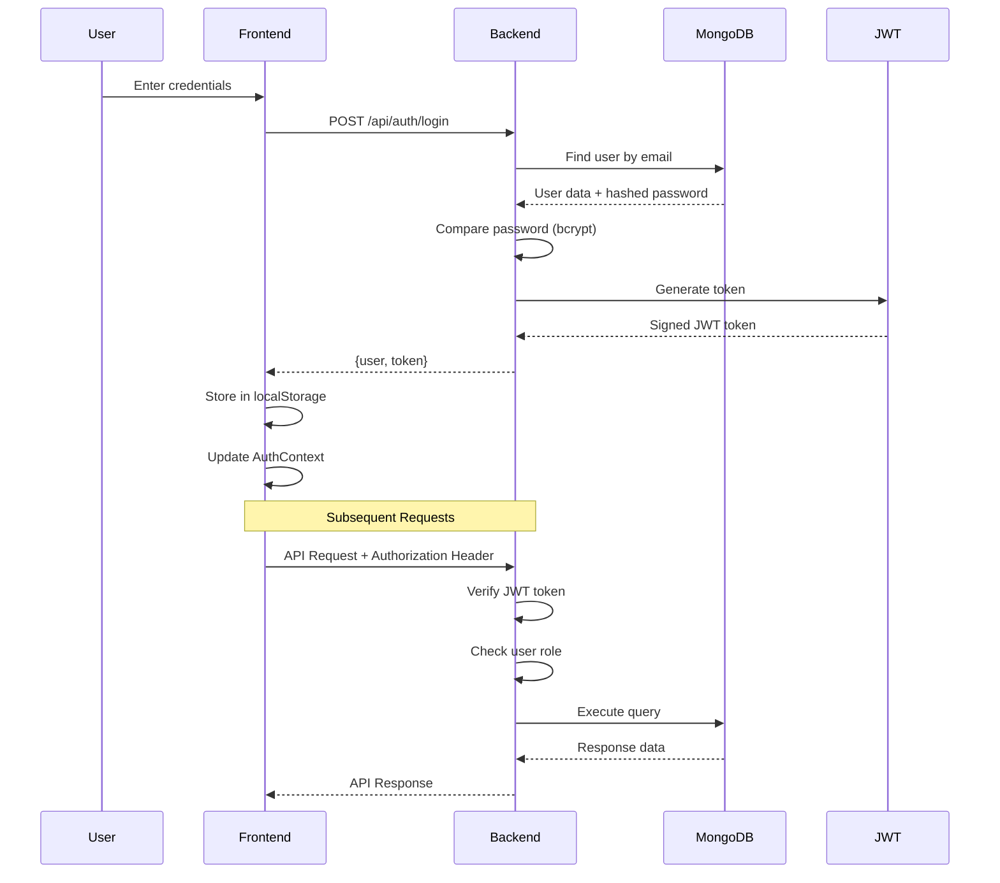

### JWT Token Structure
```
Header: { alg: "HS256", typ: "JWT" }
Payload: { id: userId, iat: timestamp, exp: timestamp }
Signature: HMACSHA256(base64UrlEncode(header) + "." + base64UrlEncode(payload), SECRET)
```

---

## 📡 API Architecture & Endpoints

### API Routes Structure

```
/api
├── /auth
│   ├── POST   /signup          - Register new user
│   ├── POST   /login           - Authenticate user
│   ├── GET    /me              - Get current user (protected)
│   └── PUT    /profile         - Update profile (protected)
│
├── /events
│   ├── GET    /                - Get all events (public)
│   ├── GET    /stats           - Get statistics (admin)
│   ├── GET    /:id             - Get single event (public)
│   ├── POST   /                - Create event (admin + upload)
│   ├── PUT    /:id             - Update event (admin)
│   └── DELETE /:id             - Delete event (admin)
│
└── /registrations
    ├── POST   /                - Register for event (protected)
    ├── GET    /user            - Get user registrations (protected)
    ├── GET    /event/:eventId  - Get event registrations (admin)
    ├── GET    /check/:eventId  - Check registration status (protected)
    └── DELETE /:id             - Cancel registration (protected)
```

### Request/Response Flow

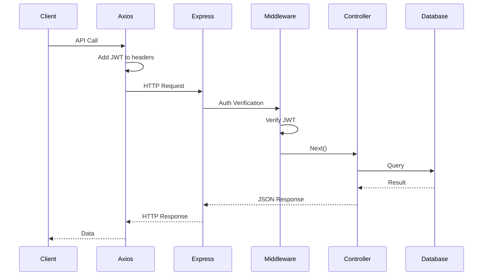

---

## 🔒 Security Architecture

### Security Layers

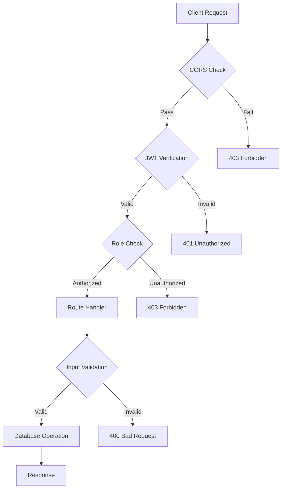

### Security Measures Implemented

| Layer | Security Feature | Implementation |
|-------|-----------------|----------------|
| **Transport** | HTTPS/TLS | Recommended in production |
| **CORS** | Origin validation | Configured in server.js |
| **Authentication** | JWT tokens | 30-day expiry, signed tokens |
| **Password** | Hashing | bcrypt with 10 salt rounds |
| **Authorization** | Role-based access | Middleware checks user.role |
| **Input Validation** | express-validator | Validates all user inputs |
| **File Upload** | Type & size limits | Multer filters (images only, 5MB max) |
| **Database** | Mongoose validation | Schema-level validation |
| **XSS Protection** | React escaping | Automatic by React |
| **SQL Injection** | N/A | NoSQL (MongoDB) |

---

## 📂 File Upload Architecture

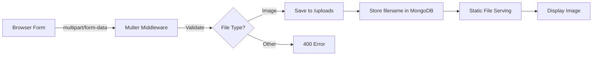

### Upload Configuration
- **Storage**: Disk storage in `/backend/uploads/`
- **Naming**: `event-{timestamp}-{random}.{ext}`
- **Allowed Types**: jpg, jpeg, png, gif, webp
- **Max Size**: 5MB
- **Access**: Static files served via Express

---

## 🌍 Google Maps Integration

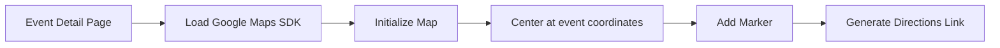

### Maps Implementation
- **SDK**: @react-google-maps/api
- **API Key**: Stored in environment variable
- **Features**: 
  - Interactive map display
  - Location marker
  - "Get Directions" link to Google Maps
  - Customizable zoom level (15)

---

## 🚀 Deployment Architecture (Recommended)

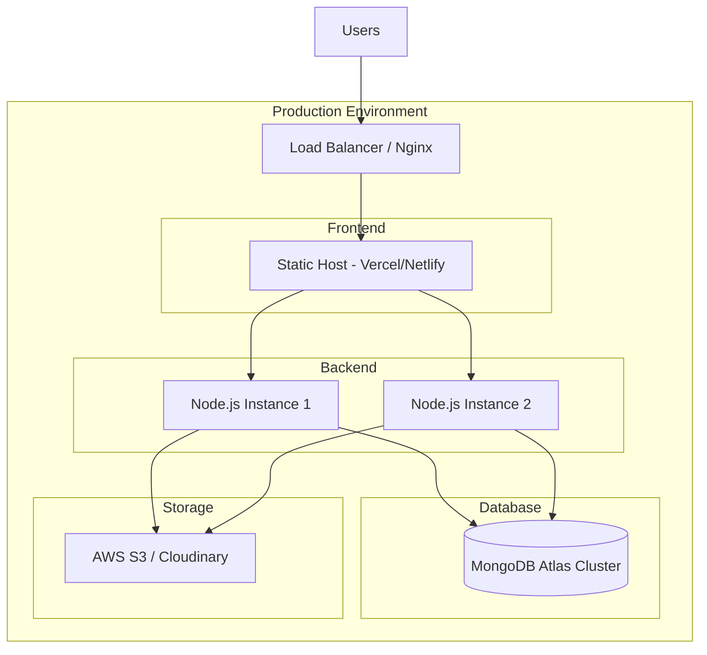

### Deployment Options

**Frontend Deployment:**
- Vercel (Recommended)
- Netlify
- AWS S3 + CloudFront
- GitHub Pages

**Backend Deployment:**
- Heroku
- Railway
- Render
- AWS EC2 / EB
- DigitalOcean

**Database:**
- MongoDB Atlas (Recommended)
- Local MongoDB (Development)

**File Storage:**
- AWS S3
- Cloudinary
- Azure Blob Storage

---

## 📊 Data Flow Diagram

### User Registration Flow
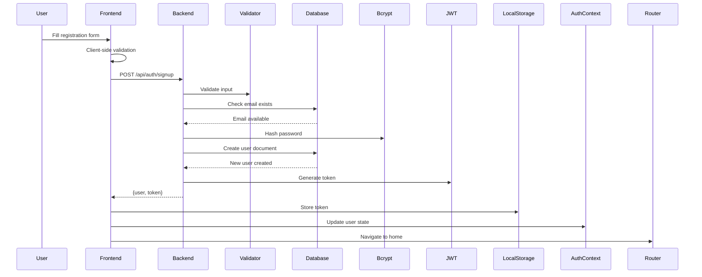

### Event Registration Flow
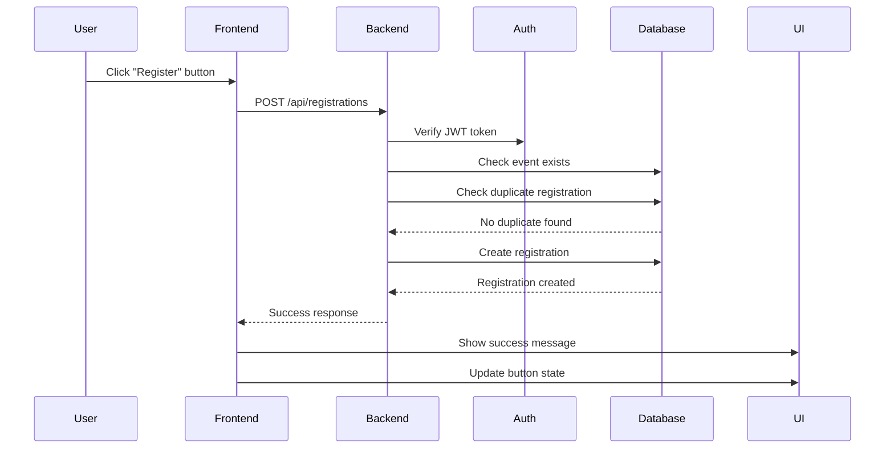

---

## 🔄 State Management Architecture

### Frontend State Flow

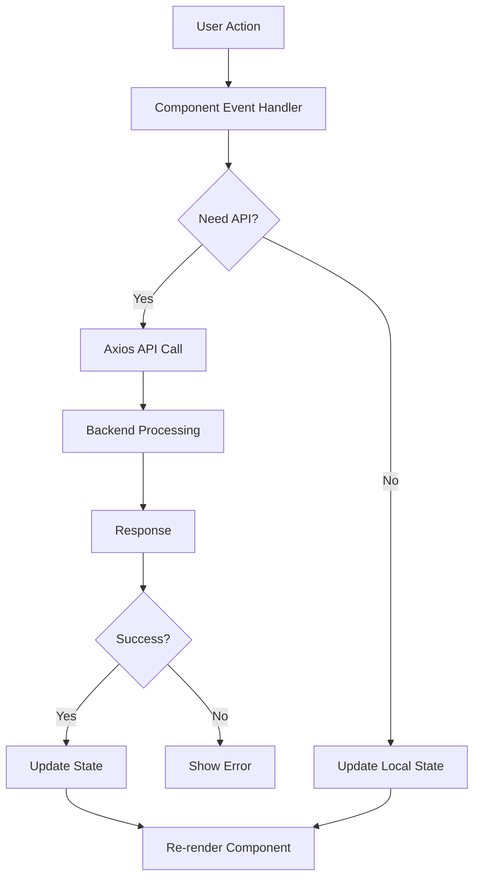

### Global State (AuthContext)
- **User**: Current logged-in user data
- **Token**: JWT authentication token
- **isAuthenticated**: Boolean authentication status
- **isAdmin**: Boolean admin role check
- **Functions**: login(), signup(), logout(), updateUserProfile()

### Local State
- Component-specific state using `useState`
- Form data, loading states, error messages
- UI state (modals, dropdowns, etc.)

---

## 📈 Performance Optimization

### Frontend Optimizations
- **Code Splitting**: React.lazy() for route-based splitting
- **Lazy Loading**: Images loaded on demand
- **Caching**: Axios response caching
- **Memoization**: React.memo for expensive components
- **Debouncing**: Search input debouncing

### Backend Optimizations
- **Database Indexing**: Compound index on registrations
- **Query Optimization**: Lean queries, field selection
- **Caching**: In-memory caching for static data
- **Compression**: Gzip compression for responses
- **Rate Limiting**: Prevent API abuse

---

## 🎯 Scalability Considerations

### Horizontal Scaling
- **Stateless Backend**: JWT tokens enable horizontal scaling
- **Database Replication**: MongoDB replica sets
- **Load Balancing**: Distribute requests across instances
- **CDN**: Static assets via CDN

### Vertical Scaling
- **Database**: Increase MongoDB resources
- **Server**: Increase Node.js memory/CPU
- **File Storage**: Move to cloud storage (S3)

---

## 📝 Summary

This Event Planning Web Application implements a **modern, scalable, and secure architecture** with:

✅ **Three-tier separation**: Frontend, Backend, Database  
✅ **RESTful API design**: Clear endpoint structure  
✅ **JWT authentication**: Stateless, scalable auth  
✅ **Role-based authorization**: Admin and user roles  
✅ **Document database**: Flexible MongoDB schema  
✅ **Modern frontend**: React with hooks and context  
✅ **Security best practices**: Password hashing, input validation, CORS  
✅ **File upload system**: Multer with validation  
✅ **External API integration**: Google Maps  
✅ **Responsive design**: Mobile-first approach  

---

**Architecture Version**: 1.0  
**Last Updated**: December 2024  
**Technology Stack**: MERN (MongoDB, Express, React, Node.js)
